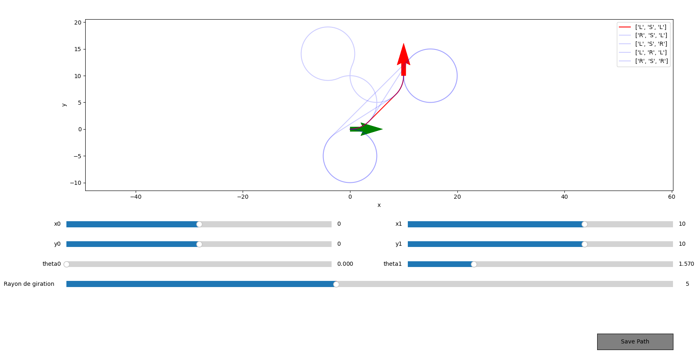

# Dubins2DPath

The **Dubins2DPath** repository is designed to generate 2D Dubins paths, which are used to plan smooth trajectories for vehicles that are constrained to turn in a minimum radius. This project allows users to define initial and final positions and orientations, visualize the resulting path, and save it for later use. The interactive interface features sliders to easily adjust parameters and a button to save the generated path.

## Features

- **Interactive Path Creation**: Use sliders to set the initial and final coordinates (x, y) and orientation (θ) of the vehicle.
- **Minimum Turning Radius**: Adjust the minimum turning radius to control the smoothness and feasibility of the generated path.
- **Real-Time Path Visualization**: View the Dubins path dynamically as you modify the parameters.
- **Save Your Path**: Click the save button to store the generated path in the *Missions* directory for future reference or use.

## How It Works

### 1. **Launch Dubins Path**
Once you launch the application, you will see a graphical interface with interactive elements such as sliders for adjusting the initial and final positions (x, y) and orientation (θ).

### 2. **Set Initial and Final Values**
- **Initial Position (x, y)**: Define the starting point of the vehicle.
- **Initial Orientation (θ)**: Set the starting orientation in radians (angle).
- **Final Position (x, y)**: Define the target destination of the vehicle.
- **Final Orientation (θ)**: Set the target orientation for the vehicle.

### 3. **Adjust Minimum Turning Radius**
Control the minimum turning radius to modify how tightly the vehicle can turn. This will affect the smoothness of the path.

### 4. **Visualize Your Path**
As you adjust the parameters, the path will be plotted in real-time on the screen, allowing you to see the trajectory the vehicle will take.

### 5. **Save Your Path**
Once you're satisfied with the path, click the **Save** button. The path will be stored in the *Missions* directory for later use.

## Example

Here’s an example of the graphical user interface:



## Installation

1. Clone the repository:
   ```bash
   git clone https://github.com/yourusername/Dubins2DPath.git

